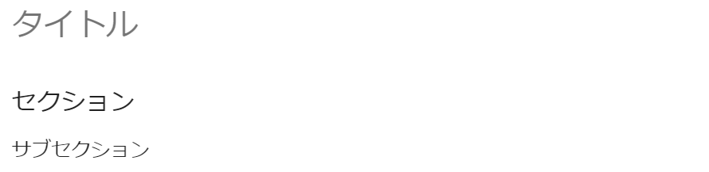
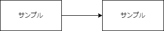
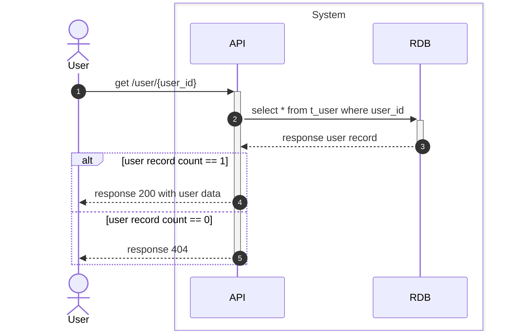

---
tags:
  - MkDocs
  - Markdown
---
# 記述サンプル
記述サンプルをいくつか提示。  
[Markdown Preview Enhanced](https://marketplace.visualstudio.com/items?itemName=shd101wyy.markdown-preview-enhanced)でも表示できるものについて記載。  
[Qiita](https://qiita.com/)や[Zenn](https://zenn.dev/)との互換性は特に調べていないので、外部サービスだと正しく表示されない可能性がある。タブやボタンを仕込むとPDF変換等の再利用性が下がるので、特殊な記述はあまりやらない方がよいかもしれない。

## 見出し

※目次が崩れるので、画像を表示例とする。

```
# タイトル
## セクション
### サブセクション
```

## 水平線
***

*****

---

-------

_ _ _
```
***

*****

---

-------

_ _ _
```

## テキスト
| 出力 | Markdown |
| - | - |
| *斜体(italic)* | `*斜体(italic)*` |
| **太字(bold)** | `**太字(bold)**` |
| ***強調(bold)*** | `***強調(bold)***` |
| ~~訂正線~~ | `~~訂正線~~` |
| ==ハイライト== | `==ハイライト==` |
| <span style="color: red; ">赤文字</span> | `<span style="color: red; ">赤文字</span>` |
| <font color="blue" size="+3" face="ＭＳ 明朝,平成明朝">fontタグによるカスタム</font> | `<font color="blue" size="+3" face="ＭＳ 明朝,平成明朝">fontタグによるカスタム</font>` |
| $e ^{i\pi}+1=0$ | `$e ^{i\pi}+1=0$` |
| :thumbsup::heart::smile: | `:thumbsup::heart::smile:` |

## 箇条書き
- a
- b
- c

```
- a
- b
- c
```

1. いち
1. に
1. さん

```
1. いち
1. に
1. さん
```

## チェックリスト
- [ ] これからやるタスク
- [x] 完了したタスク

```
- [ ] これからやるタスク
- [x] 完了したタスク
```

## 注釈
テキスト[^1]
[^1]: 注釈の内容

```
テキスト[^1]
[^1]: 注釈の内容
```

## 引用
> これは引用です。

```
> これは引用です。
```

## 警告文
!!! note

    Lorem ipsum dolor sit amet, consectetur adipiscing elit. Nulla et euismod
    nulla. Curabitur feugiat, tortor non consequat finibus, justo purus auctor
    massa, nec semper lorem quam in massa.

```
!!! note

    Lorem ipsum dolor sit amet, consectetur adipiscing elit. Nulla et euismod
    nulla. Curabitur feugiat, tortor non consequat finibus, justo purus auctor
    massa, nec semper lorem quam in massa.
```
https://squidfunk.github.io/mkdocs-material/reference/admonitions/

## 数式ブロック

$$x = \dfrac{-b \pm \sqrt{b^2 - 4ac}}{2a}$$

```
$$x = \dfrac{-b \pm \sqrt{b^2 - 4ac}}{2a}$$
```

## コードブロック
### Python
```python
#!/usr/bin/env python
def main():
    print('Hello, World!')
if __name__ == '__main__':
    main()
```

````
```python
#!/usr/bin/env python
def main():
    print('Hello, World!')
if __name__ == '__main__':
    main()
```
````

### Typescript

```typescript
console.log("HelloWorld! TypeScript.");
```

````
```typescript
console.log("HelloWorld! TypeScript.");
```
````

## 表
### Markdown記法
| 指定なし(環境依存) | 左揃え | センタリング | 右揃え |
| - | :- | :-: | -: |
| DDDDD DDDDD DDDDD | LLLLL LLLLL LLLLL | CCCCC CCCCC CCCCC | RRRRR RRRRR RRRRR |

```
| 指定なし(環境依存) | 左揃え | センタリング | 右揃え |
| - | :- | :-: | -: |
| DDDDD DDDDD DDDDD | LLLLL LLLLL LLLLL | CCCCC CCCCC CCCCC | RRRRR RRRRR RRRRR |
```

### csv読み込み（自作マクロ）
{{ csv2table('mkdocs-sample/mkdocs-sample-table.csv') }}


\{\{ csv2table('mkdocs-sample/mkdocs-sample-table.csv') \}\}  
記入例をブロックにすると\が表示されるのでブロックにしていない  

- 相対パスで指定
- 他環境だと基本的に使えないはず
    - Markdown Preview Enhanced 上だと@import構文が楽
- 自作なのでバグあるかも

## 画像
### ローカルリソース参照
[stable diffusion webui](https://github.com/AUTOMATIC1111/stable-diffusion-webui) (model:sd-v1-4) で画像作成
#### 簡易配置

```

```

#### 横並べ


```

```

#### 縦並べ


<br>
```


```

### draw.io

```

```

[https://www.drawio.com/](https://www.drawio.com/)  
[https://marketplace.visualstudio.com/items?itemName=hediet.vscode-drawio](https://marketplace.visualstudio.com/items?itemName=hediet.vscode-drawio)

## UML
### mermaid

```
%% Settings
sequenceDiagram
autonumber

%% Node
actor user as User
box System
participant api as API
participant rdb as RDB
end

%% Sequence
user->>+api: get /user/{user_id}
api->>+rdb: select * from t_user where user_id
rdb-->>-api: response user record
alt user record count == 1
    api-->>user: response 200 with user data
else user record count == 0
    api-->>-user: response 404
end
```
[https://mermaid.js.org/intro/](https://mermaid.js.org/intro/)

## 動画
### ローカルリソース参照
[stable diffusion webui](https://github.com/AUTOMATIC1111/stable-diffusion-webui) (text2video) で動画作成
<video controls playsinline width="50%" autoplay loop muted="true" src="./mkdocs-sample/mkdocs-sample-vid.mp4" type="video/mp4" >
 Sorry, your browser doesn't support embedded videos.
</video>

```
<video controls playsinline width="50%" autoplay loop muted="true" src="./sample/vid.mp4" type="video/mp4" >
 Sorry, your browser doesn't support embedded videos.
</video>
```

### Youtube
https://www.youtube.com/watch?v=jNQXAC9IVRw
<iframe width="560" height="315" src="https://www.youtube.com/embed/jNQXAC9IVRw" title="YouTube video player" frameborder="0" allow="accelerometer; autoplay; clipboard-write; encrypted-media; gyroscope; picture-in-picture; web-share" allowfullscreen></iframe>

```
<iframe width="560" height="315" src="https://www.youtube.com/embed/jNQXAC9IVRw" title="YouTube video player" frameborder="0" allow="accelerometer; autoplay; clipboard-write; encrypted-media; gyroscope; picture-in-picture; web-share" allowfullscreen></iframe>
```
共有 -> 動画の埋め込み からhtml生成

## SNS
### Twitter
<blockquote class="twitter-tweet"><p lang="en" dir="ltr">just setting up my twttr</p>&mdash; jack (@jack) <a href="https://twitter.com/jack/status/20?ref_src=twsrc%5Etfw">March 21, 2006</a></blockquote> <script async src="https://platform.twitter.com/widgets.js" charset="utf-8"></script>

```
<blockquote class="twitter-tweet"><p lang="en" dir="ltr">just setting up my twttr</p>&mdash; jack (@jack) <a href="https://twitter.com/jack/status/20?ref_src=twsrc%5Etfw">March 21, 2006</a></blockquote> <script async src="https://platform.twitter.com/widgets.js" charset="utf-8"></script>
```
もっと見る -> ツイートを埋め込む からhtml生成
